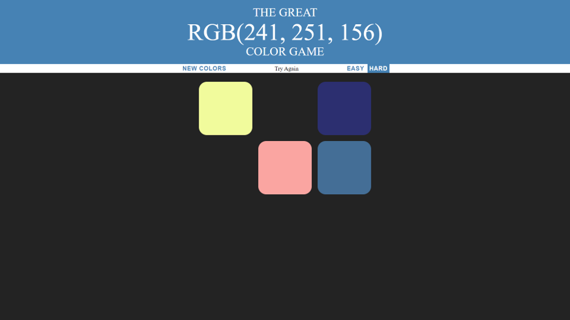

# A-Simple-Color-Guessing-Game
A simple website for guessing colors in RGB format, with two different game modes: easy and hard, default mode is set to be hard. 

There are 3 different colors to choose from for easy mode, while 6 for hard.

It generates a new set of colors each time and tells the player if he/she selects the correct one.

Click on the square that you think has the target color, it will fade away if it does not match with the target color.

All squares and the website's theme change to the target color if the guess is correct.

